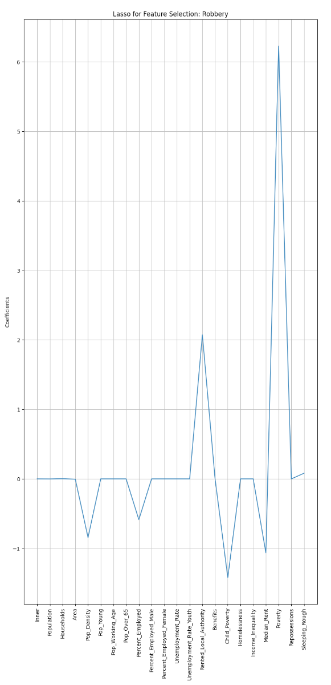
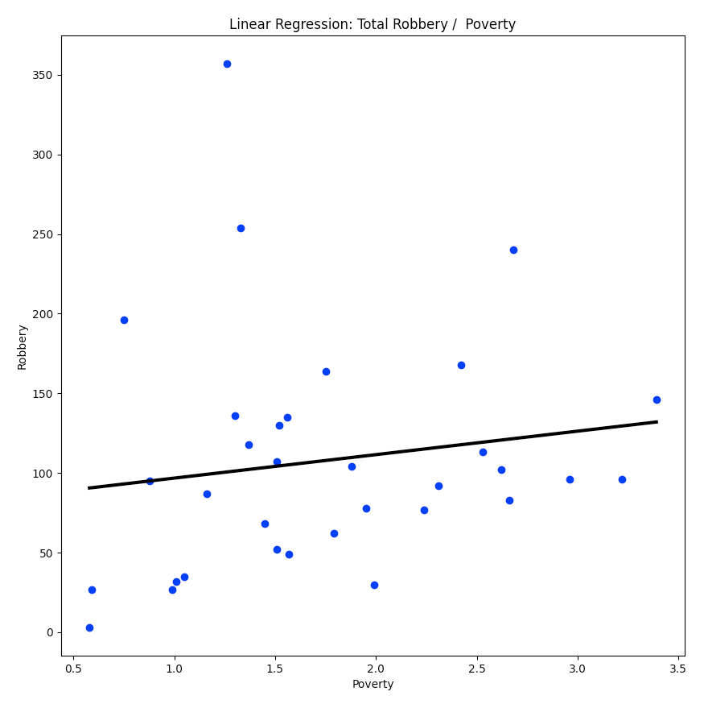

# FIL Course - Final Assessment
## Project Report

### GitHub URL 
https://github.com/tallguy999/fil-course-assessment

### Abstract
An analysis of London street crime data and London borough profile data, to identify whether there is any correlation 
between London borough key metrics (Such as poverty, unemployment, age etc.) and the amount of reported crime.

### Introduction
I previously worked with this data to understand the possible impact of the COVID pandemic on reported crime, in particular
the impact of COVID lockdowns, therefore it is a dataset of which I am familiar. Having also spent a few years serving in the 
Metropolitan Police I have some understanding as to the makeup of London and it's boroughs in relation to crime.

The code has been developed so that individual crime types can be filtered from the crime data. For the 
purpose of this exercise, that filter will be set to focus on **Public Order** offences for the month of October 2019. 

Other crime types that can be analyzed include;

- Anti-social behaviour
- Bicycle theft
- Criminal damage and arson
- Drugs
- Other crime
- Other theft
- Possession of weapons
- Public order
- Robbery
- Shoplifting
- Theft from the person
- Vehicle crime
- Violence and sexual offences

> You can set different crime types by commenting / uncommenting the relevent lines at the top of main_script.py

### Dataset
There are three sets used in this exercise; 

#### Street Crime Data
>Source: https://data.police.uk

>License: https://www.nationalarchives.gov.uk/doc/open-government-licence/version/3/

This data set consists of reported street crimes. It is published under the Open Government License 3.0 and is available 
for all UK police forces, but for this exercise I have focused on the Metropolitan Police.

The data is almost entirely categorical and comprises the following fields;

- "Reported by" and "Fall within" (Text)
    - The force that provided the data about the crime.
- Longitude and Latitude (Float)
    - The anonymised coordinates of the crime.
- LSOA code and LSOA name (Text)
    - References to the Lower Layer Super Output Area that the anonymised point falls into (See References)
- Crime type (Text)
    - One of the crime types listed in the Police.UK FAQ.
- Last outcome category (Text)
    - A reference to whichever of the outcomes associated with the crime occurred most recently. This can be cross 
    referenced with a separate 'Outcomes' dataset, but is not used in this exercise.
- Context (Null)
    - A field provided for forces to provide additional human-readable data about individual crimes. Currently, 
    this is always empty.
    
Apart from the 'Crime type' and location, there is no other detail of the actual crime itself. Any kind of analysis 
focusing on the actual crime instance will therefore be very limited. Hence, I decided to summarise and count the data 
to provide borough-specific quantitative metrics (total crimes in each borough) that I could then merge with the 
borough profile and key indicators data, to provide a spread of numeric data that could be used in machine learning and 
linear regression.

#### London Borough Profiles
>Source: https://data.london.gov.uk/download/london-borough-profiles/80647ce7-14f3-4e31-b1cd-d5f7ea3553be/london-borough-profiles.xlsx

>License: http://www.nationalarchives.gov.uk/doc/open-government-licence/version/2/

This data is provided as an Excel workbook containing three worksheets; _Profiles_, _Data_ and _Chart-Map_. We will be 
using the information within the _Data_ worksheet for this exercise.

There are 82 features provided for each borough, grouped into 11 themes;
- Demography
- Diversity
- Labour Market
- Economy
- Community Safety
- Housing
- Environment
- Transport
- Children
- Health
- Governance

_Note: The original Profiles worksheet contains source information for each feature._

#### Borough Ratings Across Key Indicators (2021)
>Source: https://www.trustforlondon.org.uk/data/boroughs/overview-of-london-boroughs/

>License: Unable to locate license info on website, though data appears to be collected from a number of different sources 
which are referenced. 

This contains further borough specific metrics focused on poverty, homelessness, unemployment etc.

In order to demonstrate the import of data from a SQL database, a subset of this data was taken from the CSV file and 
uploaded to remote SQL server, then downloaded into the script using a custom function (Get_Key_Indicators)

##### Data Quality Issues

- The data provided in the London Borough Profiles covers a wide time span, dating from March 2011 to March 2016, so 
even the most recent data is already over 5 years old. However the dates for each metric are consistent across all the 
London Boroughs. Key Indicators data is the most relevant being published in 2021.

- Crime data can be downloaded for 2018 through to 2021. From previous analysis of data collected during the pandemic, 
I'm aware that COVID lockdowns had a significant impact on the amount of reported crime during 2020, therefore I decided 
to avoid this time period completely and focus on pre-pandemic data (October 2019).

- Some data is missing for the City of London, but this is handled in the code as explained below.

### Implementation Process
1. Create three dataframes from the London Borough Profiles, Crime and Key Indicators data by calling three custom 
functions (All defined in functions_script.py). Each function imports the data then performs data manipulation 
and cleansing;

- mf.Get_Profiles(url)
    - Retrieves London Borough Profile data from remotely-hosted Excel workbook at location specified by 'url'.
    - Uses the *sheet_name* parameter to specify the worksheet to load (There are three in the workbook).
    - Uses the *usecols* parameter to specify the columns to load (We don't need all 82 columns).
    - Drop the last 6 row. These contain summed totals for Inner London, Outer London, London, England and UK.
    - Drop the first row which is blank.
    - Change the *Inner/ Outer London* column from a text column to a numeric column, by replacing instances of *Inner* 
    with 1 and *Outer* with 0, then rename the column to *Inner*.
    - Rename the remaining columns using the Excel file Profile_Column_Mapping.xlsx to map a new name against the old name.
    - Handle missing values;
        - Missing values in this file are identifed with a period (.) character. These don't get picked up by functions 
        such as *isnull()* and *dropna()*. 
        - Use a *RegEx* expression to find single period characters and replace them with a Numpy NaN value.
            - Change the debug value at the top of functions_script.py to 1 to get printed output of this process.
        - Rented_Local_Authority percentage for the City of London is missing.
            - Although the City of London does have some local authority housing, it is minimal and I've been unable to 
            find the exact figures. We'll use _half_ the lowest value in that column, using df.loc to find and replace 
            the values.
        - Gender-specific employment and unemployment figures are also missing for the City of London.
            - The total Employment figure for the City is 64% which is 8 points below the average. On that basis we will take 
        the average values for Percent_Employed_Male and Percent_Employed_Female and reduce those by 8% for the City.
     - Use the values in the *Boroughs* column to create a list of London Boroughs. This is used as a filter on the 
     crimes data.   
    - Return a dataframe as *df*
    - Return the Boroughs list as *boroughs*
    
- mf.Get_Crimes(filename, boroughs, crime)
    - Pass the name of the downloaded file, together with a list containing the names of the London Boroughs and a second
    list specify the crime (or crimes) you want to filter on.
    - Read the CSV into a data frame.
        - Use the *usecols* parameter to load only the *LSOA name* and *Crime type* columns.
    - The *LSOA name* columns consists of two values;
        - The LSOA code (See LSOA in *References* below)
        - The name of a geographic region,
    - Split out the LSOA code from the region name using str.rpartition()
    - Use the region name to create a new column and drop the original *LSOA name* column.
    - Filter on the new *Borough* column using the *boroughs* list, to remove all non-London regions.
    - Filter on the *Crime type* column using the *crime* parameter.
    - Finally use *groupby*, *count* and *sort* to create a new dataframe listing total crimes by Borough.
    - Rename the *Crime type* column to *Crime Count*.
    - Returns this dataframe as *df*
    
- mf.Get_Key_Indicators
    - Use the mysql.connector to retrieve the data hosted on remote SQL.
    - Pass the SQL query to specify the columns to retreive.
    - Returns dataframe as *df*
    
2. Merge the three dataframes into one dataframe (df); df_crimes, df_profiles and df_keyindicators on the *Borough* column, 
using pd.merge with the argument *how = "left"*.

3. Prepare for Linear Regression processes

Here we will try to predict if the London Borough Profile and Key Indicators data can be used to predict the 
amount of crime committed.

- Drop the *Boroughs* column as it is non-numeric and will cause errors.
- Create the target and feature arrays;
    - Drop the *Crime Count* column, leaving all other features and assigning to *X*
    - Slice out the *Crime Count* column to create the target array; *y*

Using *Public Order* as the Crime Type and data from October 2019 yields the following results;

    1. Linear Regression using Train_Test_Split
    test_size = 0.3, random_state = 42
    Score:  -11.23892254631344
    
    2. Linear Regression with Cross Validation
    [ 0.48140135 -0.35919451 -0.15798166 -0.03891356  0.80252637]
    Average 5-Fold CV Score: 0.1455675972593878
    
    3. Ridge Regression
    Ridge Regression / alpha = 15
    Ridge Regression:  0.6377549738325152
    
    4. Lasso Regression
    Lasso Regression / alpha = 15
    Lasso Regression:  0.7690392702770398
    
    5. HyperParameter Tuning - Grid Search CV with Ridge Regression
    Passing alpha values of 1 to 100;
    GridSearch / Best Params:  {'alpha': 36}
    GridSearch / Best Score:  -0.2073834079174365
    
### Results
  
Now use Lasso for feature selection, plotting coefficients to determine the best features for prediction.

This suggests *Rented Local Authority* is the most important feature when predicting the amount of Public Order offences
in a borough. Plot this as a linear regression for Public Order against Rented Local Authority.

### Insights
1. Running the Lasso feature selection code against various crime types indicates that Poverty and Rented Local Authority
figures are often a significant factor in the amount of crime committed.
2. Running the analysis against Public Order offences in September 2019, October 2019 and November 2019 shows consistency
in that observation, although October shows the clearest correlation.
3. Instances of _Robbery_ appear to have a very strong correlation to _Poverty_ figures (Chart below).
4. Whether or not a borough is considered 'inner' or 'outer' London appears to have little importance on crime totals.

### References
#### LSOA
Lower Layer Super Output Areas (LSOA) are a geographic hierarchy designed to improve the reporting of small area 
statistics in England and Wales. LSOAs have an average population of 1500 people or 650 households. 
Read more at; https://data.london.gov.uk/dataset/lsoa-atlas